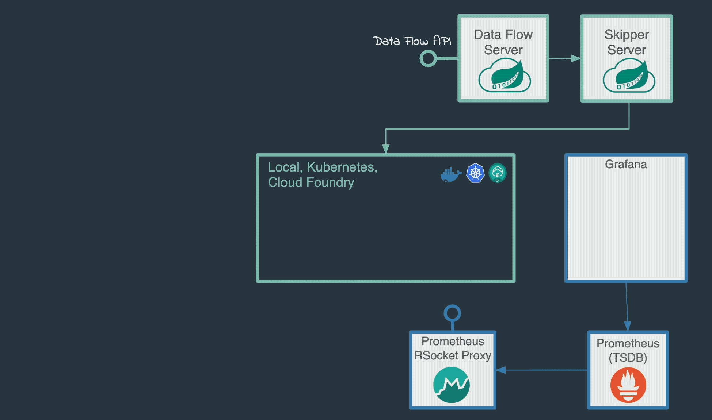

# Analytics with RabbbitMQ Streams

## Overview
This lab is a modified version of the
[Spring Cloud Dataflow Analytics Sample](https://docs.spring.io/spring-cloud-dataflow-samples/docs/current/reference/htmlsingle/#_analytics).
We can't use it as is for a few reasons; 1) the metrics app-starters have been upgraded to the new v3 functional model (a topic for
another lab) and 2) the Spring Cloud Dataflow environment needs a few upgrades to pull in the new 3.9.x RabbitMQ support for streams.
This example works without stream queues but because it's whole purpose is to stream a live flow of tweets, it is a good sample to
demonstrate the use of a stream rather than the default classic queues that are created.

The architecdture is as follows


## Step 1 Prerequisites

The prerequsite files have already been downloaded into the root directory.  Only the docker-compose-rabbitmq.yml file was modified
to incorporate the streams enabled rabbitmq broker.  Do not download the yml files but do examine the docker-compose-rabbitmq.yml
file to see how only the image needed to be modified to start the current beta version of rabbitmq broker for 3.9.x.

```yml
  rabbitmq:
    image: pivotalrabbitmq/rabbitmq-stream
    container_name: dataflow-rabbitmq
    ports:
      - "5672:5672"
      - "15672:15672"
      - "5552:5552"
    expose:
      - '5672'
      - '15672'
      - '5552'
```
For convenience in seeing what is happening with the RabbitMQ env working as our binder for Spring Cloud Dataflow we have opened up
the management port at 15672.  In addition we opened up and exposed the streams port at 5552.
